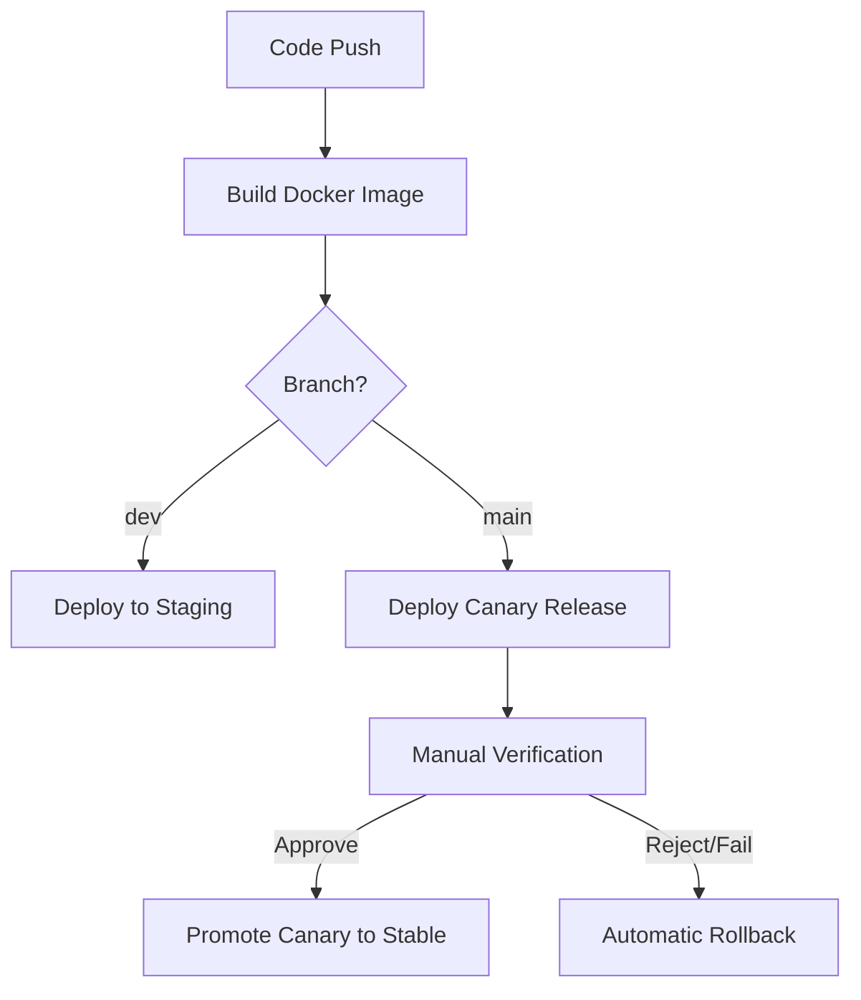

# CI/CD Pipeline Documentation

This document describes the complete CI/CD pipeline workflow implemented with GitHub Actions, which automates building, testing, and deploying the application to both staging and production environments with canary deployment capabilities.

## Table of Contents

1. [Pipeline Overview](#pipeline-overview)
2. [Pipeline Workflow](#pipeline-workflow)
3. [Environments](#environments)
4. [Workflow Files](#workflow-files)
5. [Docker Images](#docker-images)
6. [Staging Deployment](#staging-deployment)
7. [Production Deployment](#production-deployment)
   - [Canary Deployment](#canary-deployment)
   - [Promotion Process](#promotion-process)
   - [Rollback Process](#rollback-process)
8. [Environment Variables](#environment-variables)
9. [Security Considerations](#security-considerations)
10. [Troubleshooting](#troubleshooting)

## Pipeline Overview

This CI/CD pipeline implements a complete workflow for deploying code to both staging and production environments:



### Key Features

- **Multi-environment support**: Separate staging and production environments
- **Canary deployments**: Reduces risk by gradually rolling out changes in production
- **Automated rollbacks**: Quickly reverts to a stable version if deployment fails
- **Docker-based**: Containerized deployments for consistency across environments
- **High availability**: Redis Sentinel configuration for production reliability
- **Monitoring**: Integrated logging and health checks

## Pipeline Workflow

### Branching Strategy

- `dev` branch: Used for development and staging deployments
- `main` branch: Production deployments using canary method

### Workflow Sequence

1. **Build**: Docker image is built and pushed to GitHub Container Registry
2. **Deploy**:
   - For `dev` branch: Deploy to staging environment
   - For `main` branch: Deploy canary release to production (limited traffic)
3. **Promote/Rollback**:
   - For successful canary: Promote to stable release (100% traffic)
   - For failing canary: Automatic rollback to previous stable version

## Environments

### Staging Environment

- Purpose: Testing and validation before production
- Traffic: Internal users, QA team
- Configuration: Development mode with production-like data
- Deployment: Direct deployment of latest build

### Production Environment

- Purpose: Live application for end users
- Traffic: Actual users
- Configuration: Production mode with high availability
- Deployment: Canary method with gradual traffic shifting

## Workflow Files

The pipeline consists of the following workflow files:

1. **ci-cd-pipeline.yml**: Main workflow orchestrator that triggers specific jobs
2. **build-docker.yml**: Builds and pushes Docker images to GitHub Container Registry
3. **deploy-staging.yml**: Deploys to the staging environment
4. **deploy-live-canary.yml**: Deploys a canary release to production
5. **promote-canary.yml**: Promotes a canary release to stable
6. **rollback.yml**: Rolls back to the previous stable version if needed

### Pipeline Orchestration (`ci-cd-pipeline.yml`)

This is the main workflow file that orchestrates the entire CI/CD process:

```yaml
name: CI/CD Pipeline

on:
  push:
    branches:
      - main
      - dev
  workflow_dispatch: {}

jobs:
  # First build the Docker image
  build:
    uses: ./.github/workflows/build-docker.yml

  # If dev branch, deploy to staging
  deploy-staging:
    needs: build
    uses: ./.github/workflows/deploy-staging.yml
    secrets: inherit
    if: github.ref == 'refs/heads/dev'

  # If main branch, deploy canary to production
  deploy-live-canary:
    needs: build
    uses: ./.github/workflows/deploy-live-canary.yml
    secrets: inherit
    if: github.ref == 'refs/heads/main'

  # If canary deployment succeeds, promote to stable
  promote-canary:
    needs: deploy-live-canary
    uses: ./.github/workflows/promote-canary.yml
    secrets: inherit
    if: github.ref == 'refs/heads/main'

  # If canary deployment fails, rollback
  rollback:
    if: failure() && github.ref == 'refs/heads/main'
    needs: deploy-live-canary
    secrets: inherit
    uses: ./.github/workflows/rollback.yml
```

## Docker Images

The pipeline builds and manages Docker images for different environments:

- **Staging image**: Tagged as `ghcr.io/<repo>:staging-latest`
- **Production images**:
  - Latest stable: `ghcr.io/<repo>:live-latest`
  - Current version: `ghcr.io/<repo>:live-<commit-sha>`
  - Backup version: `ghcr.io/<repo>:live-backup-<timestamp>`

## Staging Deployment

The staging deployment process is managed by `deploy-staging.yml`:

1. Validates required secrets
2. Copies application files to the staging server
3. Creates or updates the `.env` file with staging configuration
4. Creates a Docker Compose override file to use the pre-built staging image
5. Pulls the latest staging image from GitHub Container Registry
6. Deploys the application using Docker Compose
7. Performs a health check to verify deployment

### Key Features of Staging Deployment

- **Simplified deployment**: Single container, direct deployment
- **Development mode**: Application runs in development mode
- **Host networking**: Exposes the application directly on port 80
- **Redis**: Uses the development Redis configuration

## Production Deployment

Production deployment uses a canary release strategy implemented in two phases:

### Canary Deployment

The canary deployment process is managed by `deploy-live-canary.yml`:

1. Validates required secrets
2. Copies application files to the production server
3. Creates or updates the `.env` file with production configuration
4. Pulls both the stable and canary Docker images
5. Creates a Docker Compose override file defining both stable and canary services
6. Deploys Redis, Sentinels, monitoring, and both application versions
7. Configures Nginx to split traffic between stable (80%) and canary (20%)
8. Performs health checks to verify deployment

#### Nginx Configuration for Canary

The canary deployment uses Nginx's `split_clients` directive to route traffic:

```nginx
# Split traffic between stable and canary based on a random number
split_clients "${remote_addr}${time_iso8601}" $upstream {
    20%   nextjs_canary;
    *     nextjs_stable;
}
```

### Promotion Process

After the canary release is verified, it's promoted to stable using `promote-canary.yml`:

1. Records deployment details for auditing
2. Creates a backup of the current stable image
3. Tags the canary image as the new stable version
4. Updates the Nginx configuration to direct all traffic to the stable version
5. Cleans up the canary container
6. Performs multiple health checks to verify the promotion

### Rollback Process

If the canary deployment fails, the rollback process is triggered automatically using `rollback.yml`:

1. Records rollback details for auditing
2. Updates the Nginx configuration to direct all traffic back to the stable version
3. Stops and removes the canary container
4. Ensures the stable version is running correctly
5. Notifies about the rollback event

## Environment Variables

The pipeline uses numerous environment variables stored as GitHub Secrets:

### Common Variables

- `APP_PORT`: Application port (default: 3000)
- `NODE_ENV`: Environment mode (development/production)
- `IS_DEV`: Boolean flag for development features

### Redis Configuration

- `REDIS_MASTER_NAME`: Name of the Redis master
- `REDIS_PASSWORD`: Redis authentication password
- `REDIS_SENTINEL_QUORUM`: Number of sentinels required for failover
- `REDIS_HOST_PROD`: Redis host for production
- `REDIS_SENTINELS_PROD`: Comma-separated list of sentinel addresses
- `REDIS_PORT`: Redis port

### Deployment Variables

- `STAGING_HOST`, `STAGING_USER`, `STAGING_SSH_KEY`: Staging server credentials
- `LIVE_HOST`, `LIVE_USER`, `LIVE_SSH_KEY`: Production server credentials
- `CANARY_WEIGHT`: Percentage of traffic routed to canary (default: 20)

### Backup Configuration

- `BACKUP_INTERVAL`: Backup frequency in seconds
- `MAX_BACKUPS`: Number of backups to retain locally
- `RETENTION_DAYS`: Number of days to keep backups
- `GDRIVE_ENABLED`: Enable Google Drive backups
- `GDRIVE_DIR`: Google Drive directory for backups

## Security Considerations

The pipeline implements several security best practices:

1. **Secrets Management**: All sensitive information stored as GitHub Secrets
2. **SSH Key Authentication**: Secure access to deployment servers
3. **Containerization**: Application runs in isolated containers
4. **Restricted Permissions**: GitHub Actions uses minimal required permissions
5. **Network Isolation**: Redis services in an isolated Docker network

## Troubleshooting

### Common Issues

#### Build Failures

- Check GitHub Container Registry permissions
- Verify Docker build configuration
- Examine logs for dependency issues

#### Deployment Failures

- Verify server connectivity and SSH keys
- Check Docker and Docker Compose installation
- Examine server disk space and resource utilization

#### Canary Deployment Issues

- Inspect Nginx configuration and logs
- Verify both containers are running
- Check port conflicts or network issues

### Logs and Monitoring

- **GitHub Actions**: Workflow logs in the Actions tab
- **Application Logs**: `docker-compose logs app`
- **Nginx Logs**: `/var/log/nginx/error.log` and `/var/log/nginx/access.log`
- **Deployment Records**: Promotion and rollback logs as GitHub Actions artifacts
